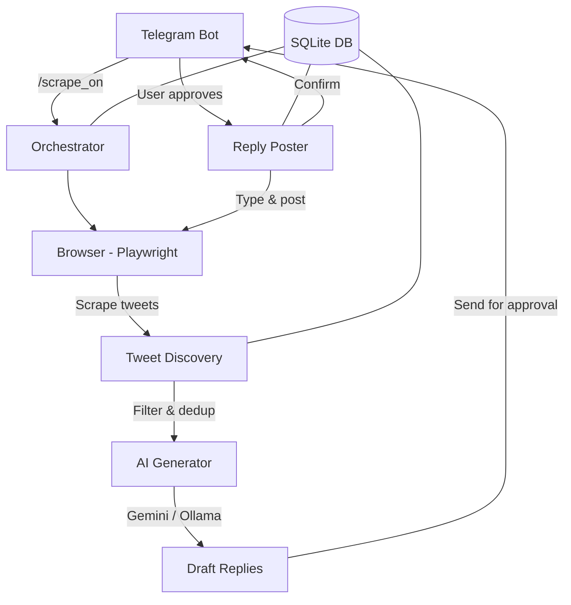

# X Engagement Agent

Personal automation tool untuk menemukan tweet trending di X (Twitter), generate draft reply menggunakan AI, dan posting setelah mendapat approval manual via Telegram.

> ⚠️ **PENTING**: Tidak ada reply yang terposting otomatis. SEMUA reply harus melalui approval manual Anda di Telegram.

> 🆕 **Scraping Control**: Scraping default **OFF**. Anda harus mengirim `/scrape_on` di Telegram untuk memulai, dan `/scrape_off` untuk pause. Gunakan `/scrape_once` untuk 1 siklus saja.

## Architecture



## Quick Start

### 1. Prerequisites

- **Python 3.11+**
- **Node.js 18+** (required by Playwright)
- **Ollama** (optional, for local AI fallback) — [Install Ollama](https://ollama.com)
- **Telegram Bot Token** — Get from [@BotFather](https://t.me/BotFather)
- **Gemini API Key** — Get from [Google AI Studio](https://aistudio.google.com)

### 2. Clone & Install

```bash
# Clone the repository
cd x-engagement-agent

# Create virtual environment
python -m venv venv

# Activate virtual environment
# Windows:
venv\Scripts\activate
# Linux/Mac:
source venv/bin/activate

# Install Python dependencies
pip install -r requirements.txt

# Install Playwright browsers
playwright install chromium
```

### 3. Configure Environment

```bash
# Copy example config
copy .env.example .env    # Windows
# cp .env.example .env    # Linux/Mac

# Edit .env with your values
notepad .env
```

**Required values to fill in:**
| Variable | Description |
|----------|-------------|
| `TELEGRAM_BOT_TOKEN` | Bot token from @BotFather |
| `TELEGRAM_CHAT_ID` | Your Telegram user ID |
| `GEMINI_API_KEY` | Google AI Studio API key |

### 4. Setup Telegram Bot

1. Open Telegram and chat with [@BotFather](https://t.me/BotFather)
2. Send `/newbot` and follow the prompts
3. Copy the bot token to your `.env` file
4. Start a chat with your bot and send `/start`
5. Get your chat ID: send a message to bot, then visit
   `https://api.telegram.org/bot<TOKEN>/getUpdates`
   and look for `"chat":{"id":YOUR_CHAT_ID}`

### 5. Setup Ollama (Optional)

```bash
# Install Ollama (visit https://ollama.com)
# Then pull a model:
ollama pull llama3
```

### 6. First Run — Manual Login

```bash
python main.py
```

On first run:
1. A Chromium browser window will open
2. You'll be redirected to X/Twitter login page
3. **Log in manually** with your account credentials
4. Once logged in, the tool will save your session
5. Future runs will reuse the saved session

### 7. Normal Usage

```bash
python main.py
```

After startup, control the agent via Telegram:

| Command | Description |
|---------|-------------|
| `/scrape_on` | Start continuous scraping |
| `/scrape_off` | Pause scraping (browser stays open) |
| `/scrape_once` | Run 1 scrape cycle then pause |
| `/status` | Check agent status & recent activity |
| `/cancel` | Cancel manual edit in progress |

## How It Works

### Tweet Discovery
1. Agent searches X using your configured queries (e.g., "AI", "tech", "startups")
2. Scrolls through "Latest" results to find fresh tweets
3. Filters: only tweets < 4 hours old with engagement above your threshold
4. Skips previously processed tweets (stored in SQLite)

### AI Reply Generation
1. Sends tweet context to **Gemini API** (primary)
2. If Gemini fails, falls back to **Ollama** (local LLM)
3. Generates 3 diverse reply options:
   - Insightful perspective
   - Witty/humorous take
   - Thoughtful question or personal take

### Telegram Approval
1. You receive a formatted message with the tweet details and 3 draft replies
2. Tap one of the buttons:
   - **✅ Draft 1/2/3** — Approve and post that draft
   - **✏️ Edit Manual** — Type your own reply
   - **⏭️ Skip** — Don't reply to this tweet
3. Reply is ONLY posted after your explicit approval

### Reply Posting
1. Browser navigates to the tweet
2. Types reply character-by-character with human-like timing
3. Posts the reply
4. Sends confirmation back to Telegram

## Safety Features

- 🛡️ **Manual approval required** — No automated posting
- 🎮 **Manual scraping control** — Start/stop via Telegram at will
- ⏱️ **Rate limiting** — Max 3 replies/hour (configurable)
- 🌙 **Active hours** — No activity during configured sleep hours
- 🎲 **Random delays** — All timings randomized (scroll, type, wait)
- 🖥️ **Headful browser** — Visible window, not headless
- 📝 **Full audit log** — Every action logged to file
- 🔒 **Session monitoring** — Alert if X session expires

## Project Structure

```
x-engagement-agent/
├── browser/
│   ├── session.py      # Browser session management
│   ├── scraper.py      # Tweet discovery & DOM parsing
│   └── poster.py       # Reply posting with human typing
├── ai/
│   ├── generator.py    # AI orchestrator (Gemini → Ollama)
│   ├── gemini_provider.py
│   ├── ollama_provider.py
│   └── prompts.py      # Prompt templates
├── telegram/
│   └── bot.py          # Approval bot & scraping control
├── db/
│   ├── models.py       # SQLite schema
│   └── queries.py      # Database operations
├── config/
│   ├── settings.py     # Config from .env
│   └── selectors.py    # X DOM selectors (easy to update)
├── logs/               # Activity logs (auto-created)
├── browser_data/       # Saved browser session (auto-created)
├── main.py             # Entry point
├── requirements.txt
├── .env.example
└── README.md
```

## Troubleshooting

### "Session invalid" alert
X/Twitter occasionally logs you out. When this happens:
1. The agent sends a Telegram alert and pauses scraping
2. Open the browser window (it stays open)
3. Log in manually
4. Send `/scrape_on` to resume

### Selectors broken (tweets not found)
X frequently updates their frontend. If scraping stops working:
1. Check `config/selectors.py`
2. Open X in a browser, inspect elements, update selectors
3. Key selectors to check: `TWEET_ARTICLE`, `TWEET_TEXT`, `USER_NAME`

### Gemini API quota exceeded
The agent automatically falls back to Ollama. Make sure Ollama is running:
```bash
ollama serve
ollama pull llama3
```

### Browser won't launch
```bash
# Reinstall Playwright browsers
playwright install chromium --with-deps
```

## License

Personal use only. This tool is for managing your own X/Twitter account.
